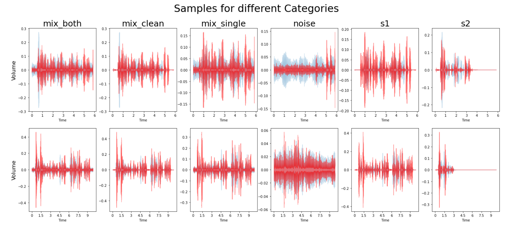
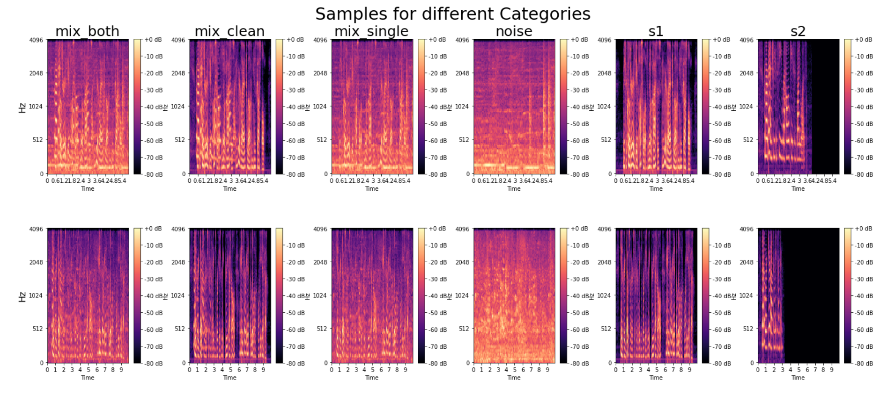

### ReadME

## 1 Objective
The objective of this project is to develop a speech separation system for a multi-talker environment with two or more speakers.

## 2 Description 
In this project, we have developed a deep-learning solution for a single-channel speaker-independent speech separation system.

It allows a user to separate the speech of an individual speaker from an audio clip having multiple speakers speaking simultaneously. 
 

 

 

	<b>Figure 2.0: Google colab with table of content</b>

	  

# 3 Methodology
## 3.1 Data Preparation
In this project, the LibriMix dataset was used to train the model.

  
 
 

	<b>Figure 3.0: Libri3Mix Train Dataset structure</b>

	  
	
## 3.2 Exploratory Data Analysis
 
EDA or Exploratory Data Analysis is an approach or technique used for the analysis of the data using various visualization techniques to get valuable insights from it.
As our data is an audio dataset, the analysis is done by plotting various types of graphs and waveforms.
   

 
 

	<b>Figure 3.1: EDA Code Snippet</b>

	  

## 3.2.1 EDA Image Results
 
 
 

	<b>Figure 3.2:    Graphs for Amplitude vs Time</b>

	  
 
 
 

	<b>Figure 3.3:   Graphs for Harmony and Percussion of Sounds</b>

	  

 
 

	<b>Figure 3.4  Mel Spectrograms for different samples</b>

	  

## 3.3 Model Selection and Training

## 3.3.1 Class Description
 
	* Class: Deep model
		 - It is a class implementing various methods for creating speech separation models on demand.
		 - It contains various methods such as:
			 __init__(): It is a constructor function that takes keyworded arguments containing parameters used for model creation.
			 For example n_src(number of speakers), n_filter(number of filters), sample_rate, stride, etc
			 get_model(): It returns the model created as per user requirement.
			 create_conv_model(): It created the ConvTasNet model as per the specifications provided by the developer.
			 create_dprnn_model(): It created the DPRNNTasNet model as per the user's requirement.
			 load_my_model(): It is used to load a model from its saved copy.
		 
	* Class: Training
		 - It is a model training class that trains models on data provided by the user in the form of train loaders.
		 - It contains various methods such as:
			 __init__(): It is a constructor function that initializes various parameters, setup the model trainer and trains the model.
			 get_optimizer(): It returns optimizer functions required in model training.
			 setup_system(): It implements the system object which is a wrapper class
			 clear_cache(): It is used to clear the cache memory of the GPU.
			 get_gpu_memory_summary(): It retrieves the memory summary of the GPU being used in training.
		 
	* Class: Tester
		 - It is a tester class that takes the model and runs test audio separation and generates output in the test directory.
		 - It contains the following methods:
			 __init__(): It initializes the model and test directory parameters required for test audio separation.
			 prepare_test(): It removes the previous test file and result from the test directory preparing it for the next test.
			 test(): It prepares the test directory, creates a copy of the test speech, and runs the separation function on the test file from the model.
			 view_results(): It displays test samples and their result speeches.
 
## 3.4 Test Result
### 3.4.1 2-Speakers Speech Separation

	<b>Figure 3.5 Wave plot graph for 2-speaker mixture and output</b>

	  	

		<b>Figure 3.6 Comparison of wave plots for actual and separated speeches</b>

	  
		

		<b>Figure 3.7 Mel spectrograms for actual and predicted speeches</b>

	  

### 3.4.2 3-Speakers Speech Separation

		<b>Figure 3.8 Wave plot graph for 3-speaker mixture and output</b>

	  	

		<b>Figure 3.9 Comparison of wave plots for actual and separated speeches</b>

	  
		

		<b>Figure 3.10 Mel spectrograms for actual and predicted speeches</b>

	  

### 3.5 Web Application
 
It is a shareable demonstration window that can be used to view results on any device by setting 'share' a launch parameter 'True'. 
It displays original audio for a mixture of speakers, separated audio by our model, and original individual speaker audio.
  

 

	<b>Figure 3.11 Gradio Web application</b>

	  

# Diagrams

The below diagram is a class diagram representing a static view describing different aspects of our system. The class diagram illustrated a collection of classes, i.e., deep_models, training, and tester, and their association with each other providing an overview of the overall structure of the system.
  

    

 

	<b>Figure 4.0 Class diagram for proposed work</b>

	  

The below figure shows the sequence flow of the work that is followed in this project. The flow starts with the user configuring the environment and importing the data, followed by the creation of the model architecture. After this step, the training and validation are done after which the output is stored and displayed as the result.
  

    

 

	<b>Figure 4.1 Sequence diagram for proposed work</b>

	  

This diagram shows the division in roles and responsibilities in this project in which the developer's roles were to load the dataset, input the necessary model parameters and then train and validate the model whereas the responsibilities of the tester were to test the model and then store and display the results obtained from it.
 

    

 

	<b>Figure 4.3 Usecase diagram for proposed work</b>

	  

 
 

# 5 Contributor
1. Dhruv Saini  
     . LinkedIN - https://www.linkedin.com/in/dhruv73     
     
# 6 Requirements
	
* Operating System - Windows 10/11

* Softwares : 
	
		- Python 3
		
		- Nvidia Cuda 11.4 
		
		- CUDA Deep Neural Network (cuDNN)
		
		- Jupyter Notebook
		
		- Visual Studio Code
		
		- Git bash
		
		- Sound eXchange [SoX 14.4.2]
	
* Hardware:

		[Laptop]
		
			- CPU: Intel Core i5-8300H 
		
			- Memory: 8GB 
			
			- GPU: NVIDIA GeForce GTX 1050ti
			
			- Disk Space: 300GB
		
		
		[Google Colab]
		
			- System RAM: 12.7 GB
			
			- Disk: 107.7 GB
			
			- GPU or TPU Type: T4
			  
	
