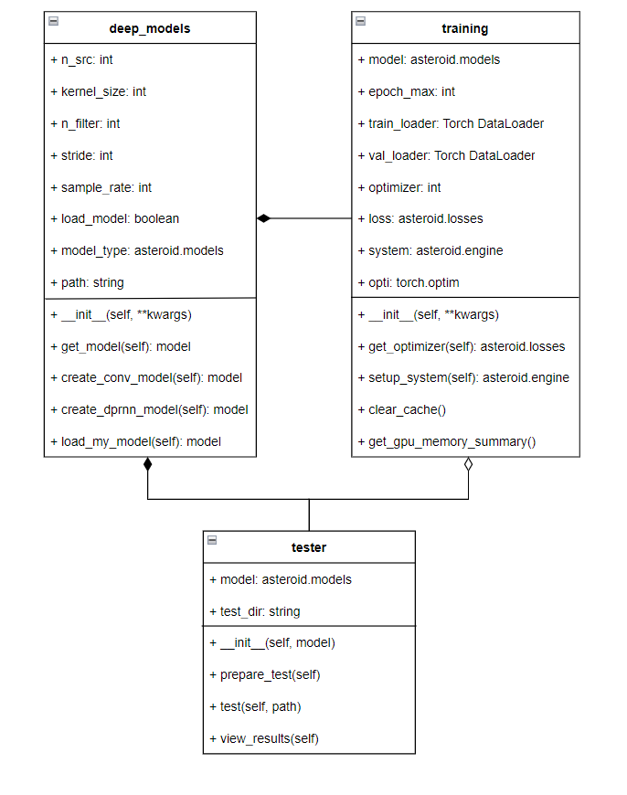

### ReadME

## 1 Objective
The objective of this project is to develop a speech separation system for multi-talker environment with two or more speakers. 

## 2 Description 
In this project, we have developed a deep learning solution for single-channel speaker independent speech separation system.

It allows a user to separate speech of individual speaker from an audio clip having multiple speaker speaking simultaneously. 
 

 

 

	<b>Figure 2.0: Google colab with table of content</b>

	  

# 3 Methodology
## 3.1 Data Prepration
In this project, LibriMix dataset was used to train the model.

  
 
 

	<b>Figure 3.0: Libri3Mix Train Dataset structure</b>

	  
	
## 3.2 Exploratory Data Analysis
 
EDA or Exploratory Data Analysis is an approach or technique used for the analysis of the data using various visualization techniques to get valuable insights from it.
As our data is an audio dataset, the analysis is done by plotting various types of graphs and wave forms.
   

 
 

	<b>Figure 3.1: EDA Code Snippet</b>

	  

## 3.2.1 EDA Image results
 
 
 

	<b>Figure 3.3:   Graphs for Harmony and Percussion of Sounds</b>

	  

 
 

	<b>Figure 3.4  Mel Spectrograms for different samples</b>

	  

## 3.3 Model Selection and Training

## 3.3.1 Class Description
 
	* Class: Deep model
		- It is a class implementing various methods for creating speech separation models on demand.
		- It contain various methods such as:
			__init__(): It is a constructor function which takes keyworded arguments containing parameters used for model creation.
						For example: n_src(number of speakers), n_filter(number of filter), sample_rate, stride etc
			get_model(): It return the model created as per user requirement.
			create_conv_model(): It created ConvTasNet model as per the specifications provided by the developer.
			create_dprnn_model(): It created DPRNNTasNet model as per the user requirement.
			load_my_model(): It is used to load a model from its saved copy.  

 
	* Class: Training
		- It is a model training class which train model on data provided by user in the form of train loaders.
		- It contain various methods such as:
			__init__(): It is a constructor function which initializes various parameters, setup model trainer and train the model.
			get_optimizer(): It returns optimizer functions required in model training.
			setup_system(): It implements system object which is a wrapper class
			clear_cache(): It is used to clear cache memory of GPU.
			get_gpu_memory_summary(): It retrieve memory summary of GPU being used in training.

 
	* Class: Tester
		- It is a tester class which take model and run test audio separation and generate output in test directory.
		- It contain following methods:
			__init__(): It initializes model and test directory parameters required for test audio separation.
			prepare_test(): It removes previous test file and result from test directory prepairing it for next test.
			test(): It prepares the test directory, creates a copy of test speech and run separation function on test file from model.
		    view_results(): It displays test sample and their result speeches. 

## 3.4 Test Result
### 3.4.1 2-Speakers Speech Separation

	<b>Figure 3.5 Wave plot graph for 2-speaker mixture and output</b>

	  	

		<b>Figure 3.6 Comparison of wave plots for actual and separated speeches</b>

	  
		

		<b>Figure 3.7 Mel spectrograms for actual and predicted speeches</b>

	  

### 3.4.2 3-Speakers Speech Separation

		<b>Figure 3.8 Wave plot graph for 3-speaker mixture and output</b>

	  	

		<b>Figure 3.9 Comparison of wave plots for actual and separated speeches</b>

	  
		

		<b>Figure 3.10 Mel spectrograms for actual and predicted speeches</b>

	  

### 3.5 Web Application
 
It is a shareable demonstration window which can be used to view result on any device by setting 'share' a launch parameter 'True'.
It displays original audio for mixture of speaker, seperated audio by our model and original individual speaker audio.
  

 

	<b>Figure 3.11 Gradio Web application</b>

	  

# Diagrams

 
The below diagram is a class digram representing a static view describing different aspects 
of our system. The class diagram illustrated collection of classes, i.e., deep_models, 
training and tester, and their association with each other providing an overview of overall 
structure of the system.
 

    

 

	<b>Figure 4.0 Class diagram for proposed work</b>

	  
 
The below figure shows the sequence flow of the work that is followed in this project. The 
flow starts with the user configuring the environment and importing the data, followed by 
the creation of the model architecture. After this step, the training and validation is done 
after which the output is stored and displayed as the result.
  

    

 

	<b>Figure 4.1 Sequence diagram for proposed work</b>

	  
 
This diagram shows the divison in roles and responsibilities in this project in which 
developer’s roles were to load the dataset, input the necessary model parameters and then 
train and validate the model whereas the responsiblities of the tester were to test the model 
and then store and display the results obtained from it.
 

    

 

	<b>Figure 4.3 Usecase diagram for proposed work</b>

	  

 
 

# 5 Contributor
1. Dhruv Saini  
     . LinkedIN - https://www.linkedin.com/in/dhruv73     
     
# 6 Requirements
	
* Operating System - Windows 10/11

* Softwares : 
	
		- Python 3
		
		- Nvidia Cuda 11.4 
		
		- CUDA Deep Neural Network (cuDNN)
		
		- Jupyter Notebook
		
		- Visual Studio Code
		
		- Git bash
		
		- Sound eXchange [SoX 14.4.2]
	
* Hardware:

		[Laptop]
		
			- CPU: Intel Core i5-8300H 
		
			- Memory: 8GB 
			
			- GPU: NVIDIA GeForce GTX 1050ti
			
			- Disk Space: 300GB
		
		
		[Google Colab]
		
			- System RAM: 12.7 GB
			
			- Disk: 107.7 GB
			
			- GPU or TPU Type: T4
			  
	
